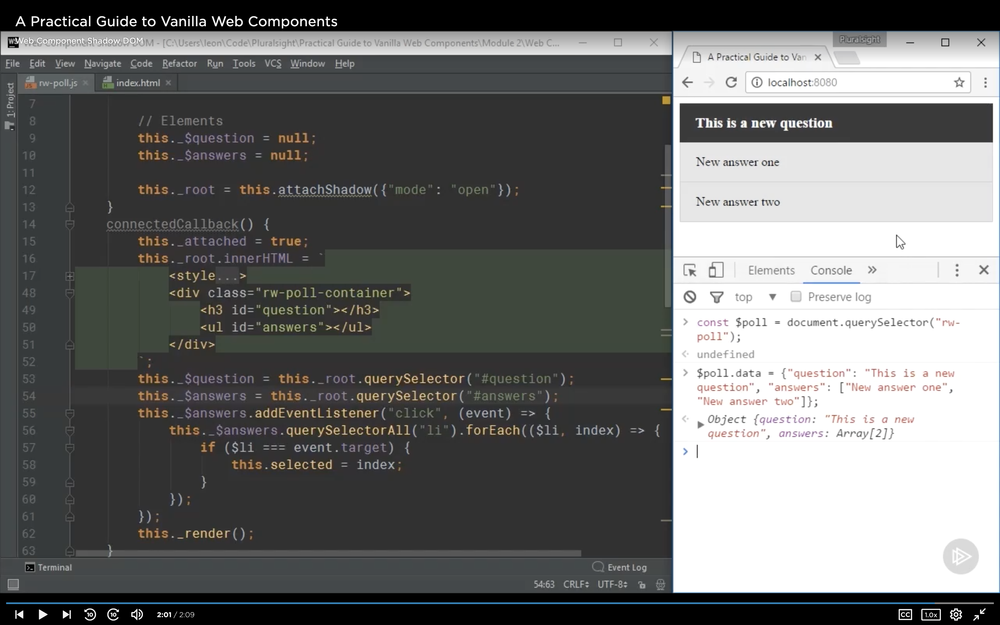

# **Web Component Shadow DOM**

- The Shadow DOM is one of the most powerful features of Web Components.
- Getting the encapsulation benefits of the Shadow DOM in your component is very easy.

## **In this demo:**

- In this demo we're going to modify the pull component we created earlier to gain the benefitis of the shadow DOM.

add

- We'll create a shadow root for a Web Component (We'll demostrate how easy is to create a subdom tree for your Web Component).
- Adding and updating the template within the Shadow DOM (We'll learn how to add your component's template to this subDOM tree and also how to update it).

  :)
