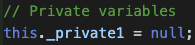
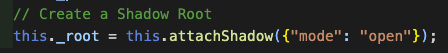
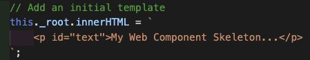
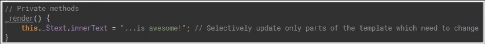
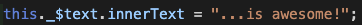
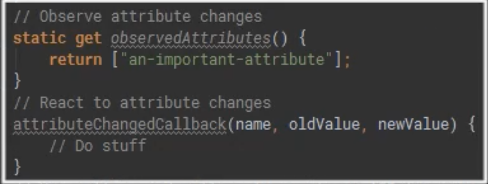
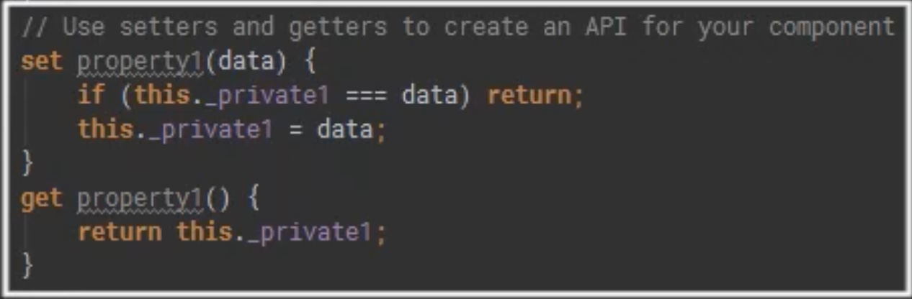
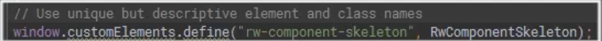

# **Web Component Skeleton**

This is a Web Component skeleton which you can be used as a starting point for all of our Web Components

- 1. It shows how to declare private variables

 
 

<!--  -->

- 2. How to create a Shadow Root

 
 

- 3. How to add a initial template

 
 

- 4. To store a reference to s

 
 

- 5. How to declare private methods

 
 

- 6. And the best practice for selectively updating

 
 

- 7. How to observe certain attribute changes

 

- 8. How to create an API

 
 

- 9. Best practices for elements and class naming

 

 

:)
