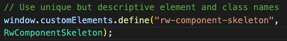

# **Web Component Skeleton**

This is a Web Component skeleton which you can be used as a starting point for all of our Web Components

- 1. It shows how to declare private variables

 
 

- 2. Create a Shadow Root for your components

 
 

- 3. Where to add an initial template

 
 

- 4. To store a reference to important elements for later use and the prefix DOM elements with a dollar sign

 
 

- 5. How to declare private methods

 
 

- 6. And the best practice for selectively updating template content

 
 

- 7. How to observe certain attribute changes and react to them

 

- 8. How to create an API for your component with properties

 
 

- 9. Best practices for element and class naming

 

 

:)
