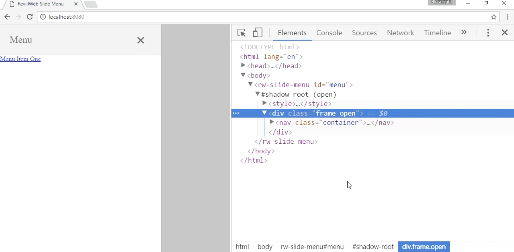
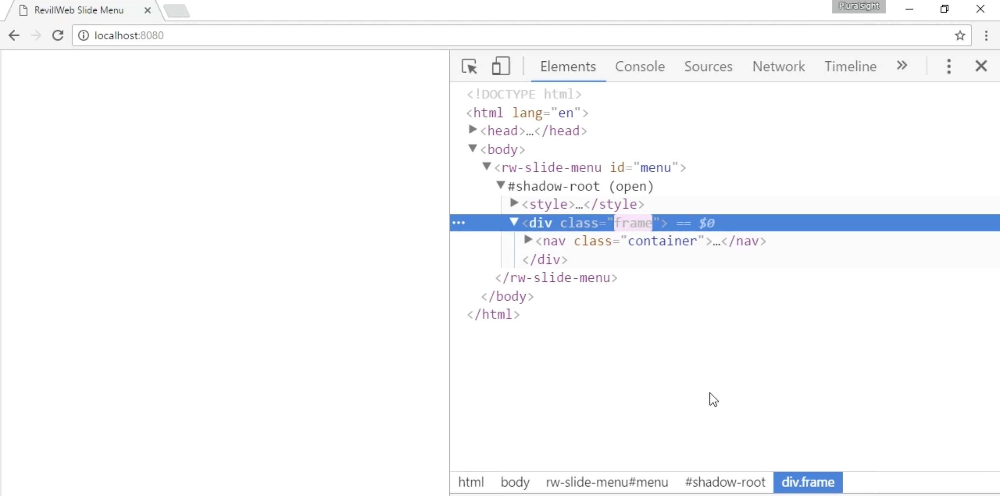

# **Creating a Configurable Slide out Menu Component**

## **In this demo:**

- We'll create and define de custom element.
- We'll add the initial template
- and also add the template CSS including slide-in animation.

 

