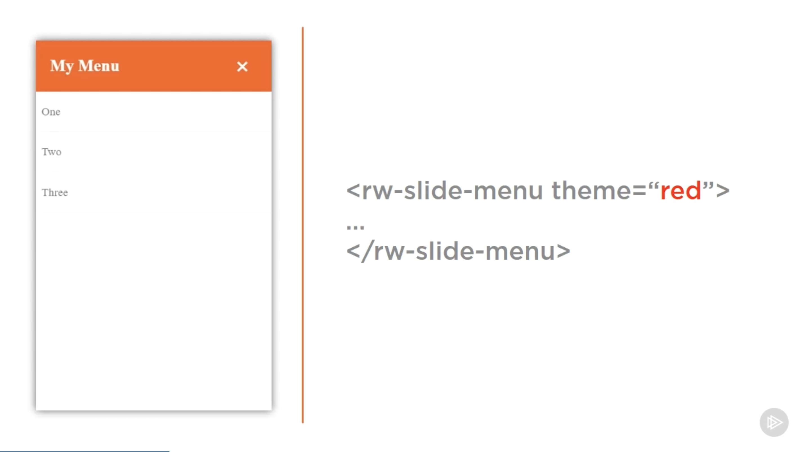
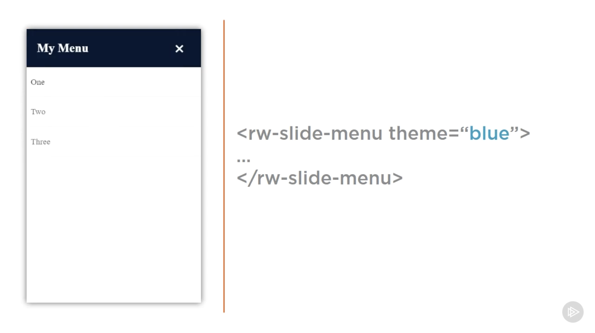
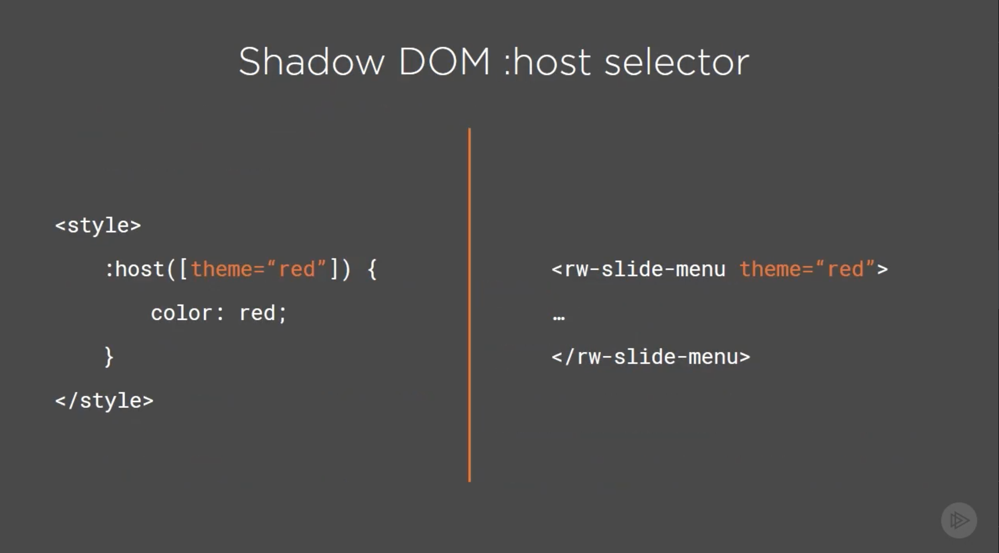
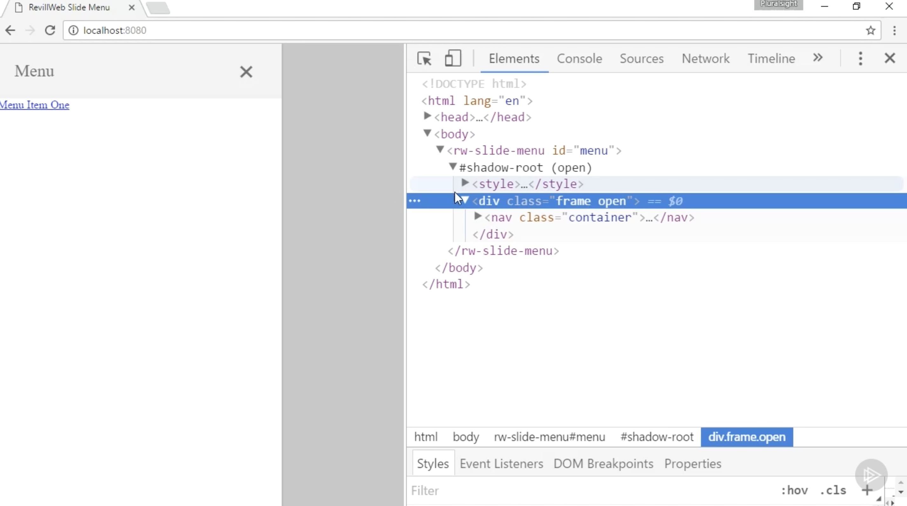
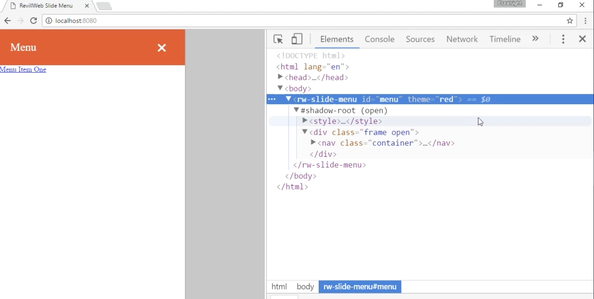
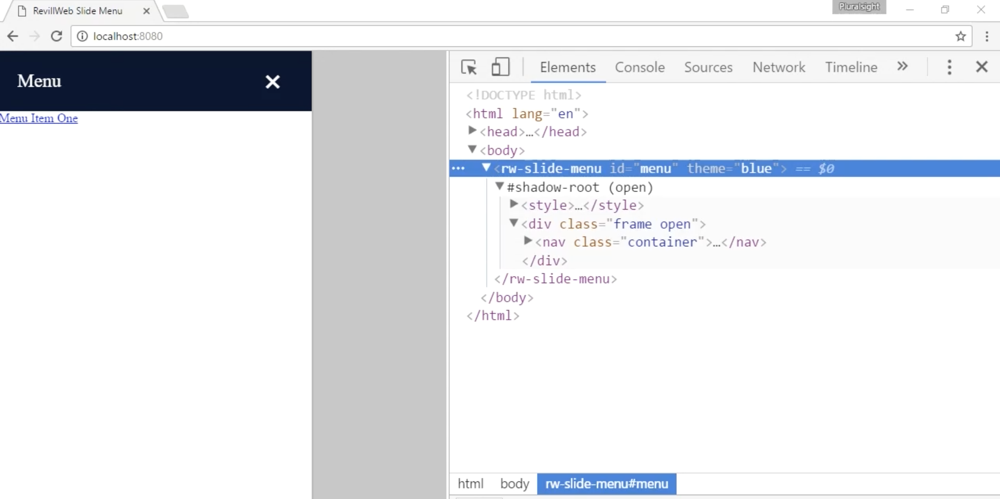

# **Styling the host**

- In the **Creating A Star Rating Component module** we touched on using the :host selector to apply style to our component when it had a certain attribute. We're going to use this technique again in this component, but we'll introduce some **more capabilities of the :host selector**.

- To recap: We want the user to be able to specify some bake-in themes by the theme attribute. When a user changes the attribute value to blue, the blue theme should be used.

- When it comes to applying styling based on host element attributes, classes or state, such as hover, there is a much easier approach. Within the **Shadow root** of an element, you're able to use the **:host selector to select the Shadow Root host**, and are also able to specify some other selection criteria

## **In this demo:**

- We now have the foundation of our slide-out menu components, and can start adding some features.
- So, we're going to implement the red and blue theme for the component, which will be selectable by theme attribute.
- We'll do this using only CSS, thanks to the :host selector.

### **Some more info:**

- (6) If we open the project in the browser we can try out these themes.
- (7) We're going to need to simulate opening the menu again using the open class

- (8) Once we've done that, we can then specify the theme attributes on the custom element, starting with red, we can see it gets applied.

- (9) And then changing the changing the value to blue, we can see that instantly the blue theme gets applied.

- This demostrates that using the :host selector can really simplify adding theming and styling to your component, instead of falling back to a more complicated JavaScript implementation.
