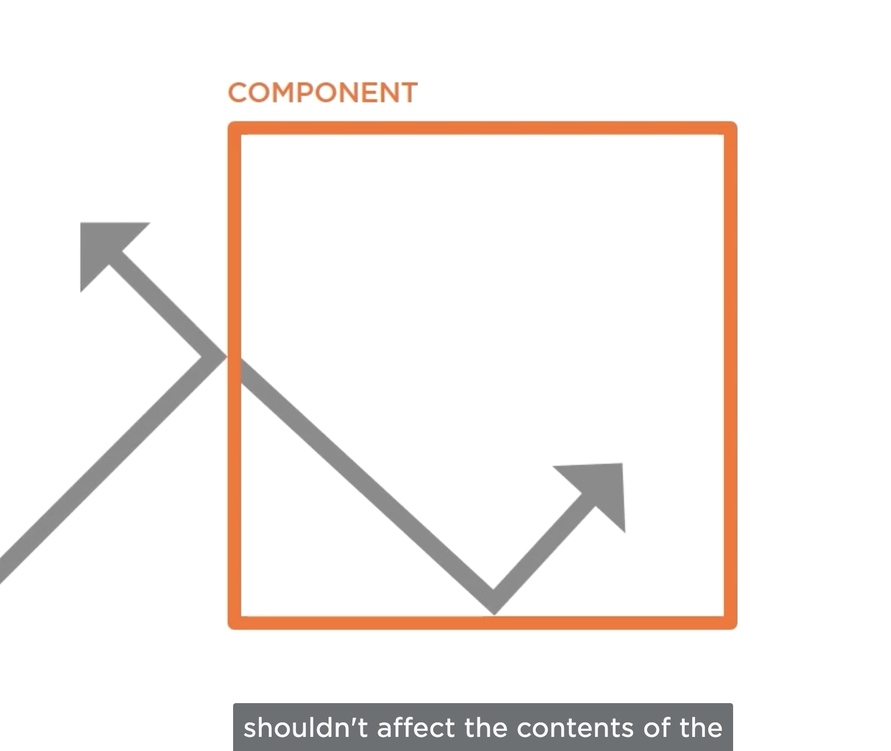
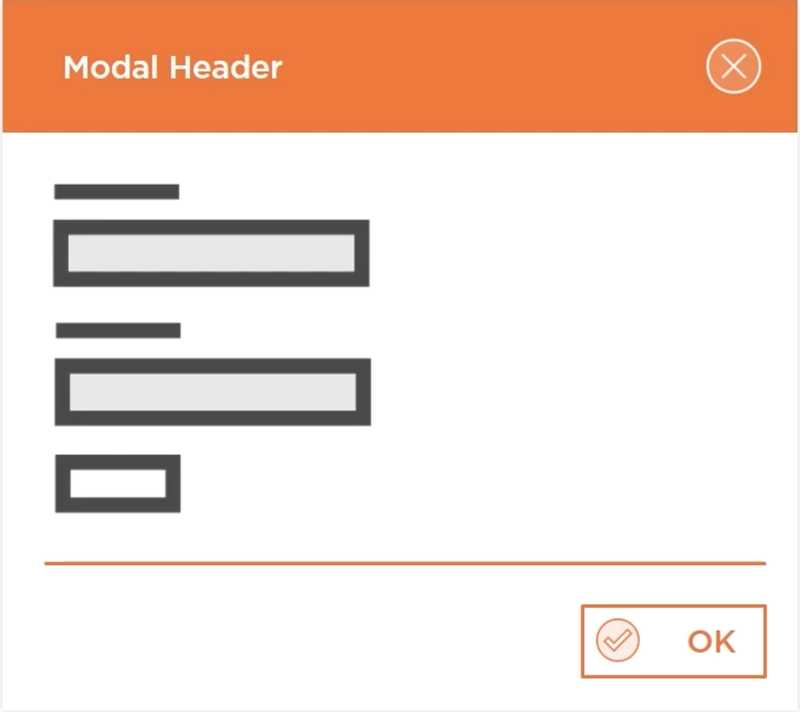
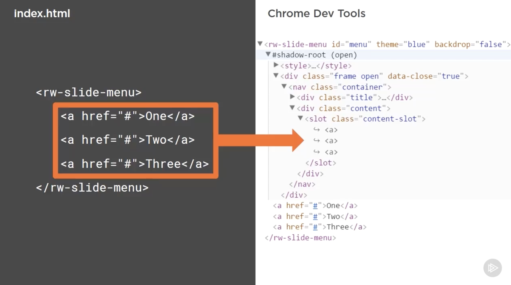

# **Allowing Users to Provide Content with Slotting**

- To finish it, we're going to use another feature of the Shadow DOM. This feauture is called **slotting**.
- Throughout these modules, we will have come to learn that Web Components are all about **encapsulation**, particularly in relation with thw **Shadow DOM**.

- The idea being that Web Component shouldn't affect the outer application and the outer application shouldn't affect the contents of the component.

- But, what about components which require content from the user to be useful: a modal for example is useless unless the user is able to specify the content they want to display inside the modal component.

- The Slide-out menu is exactly the same. We want the users to specify the content inside the menu. This could be any HTML: an image, some text, a few buttons or a list.

- Slotting allows us to do this: As a component user, we can add content as child elements to the Web Component, and then as a component author, using slotting, we can choose where this content is placed whithin the **Shadow Root** of our Web Component.

- The slotting feature projects the content into the **Shadow DOM**, making the elements appear to be within the Shadow Root of the component, but are actually kept within the **Light DOM** of the component. This means that **the usual styling restrictions of the Shadow DOM don't apply to the slotted content**. This is a huge benefit, because component users will be able to style the content they've provided to the component, just like they would style any other DOM elements which was outside of a Shadow Root.

## **In this demo:**

- We'll add slots to the component template for both the menu content and the menu title.
- We'll also add some default style for slotted content
- And finally, we'd specify some fallback text for the title slot, to ensure there's always a title for the menu.

