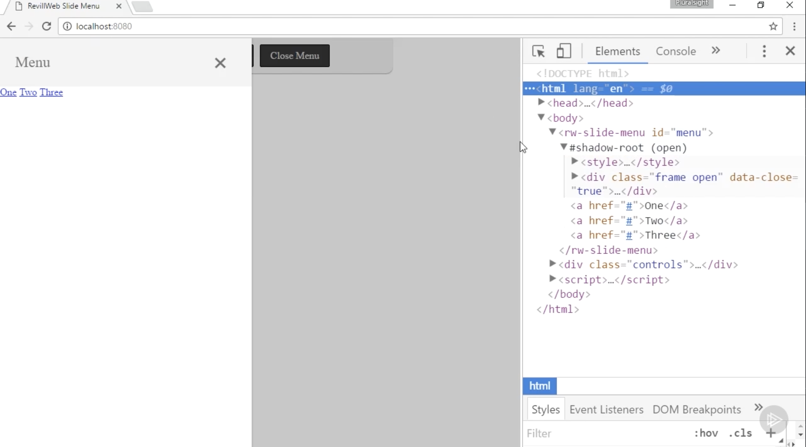
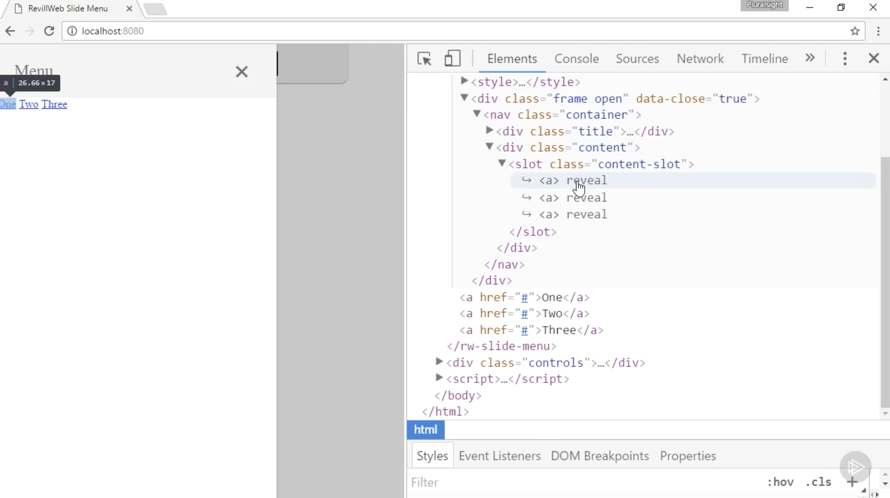
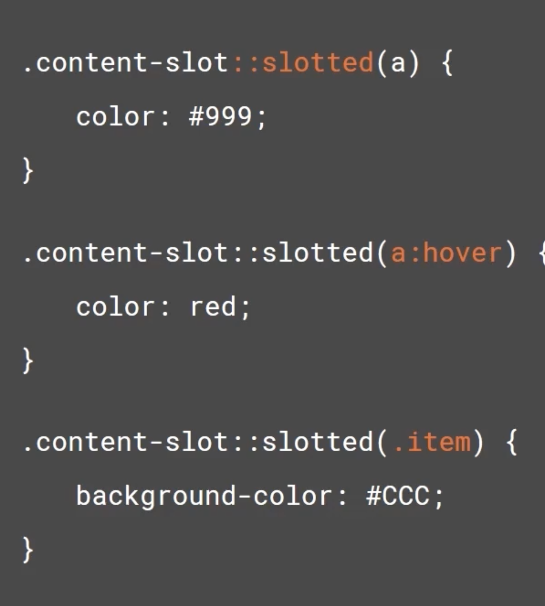
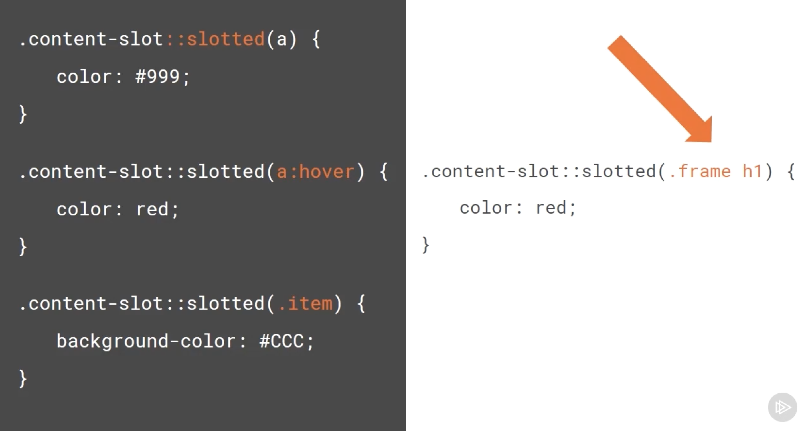
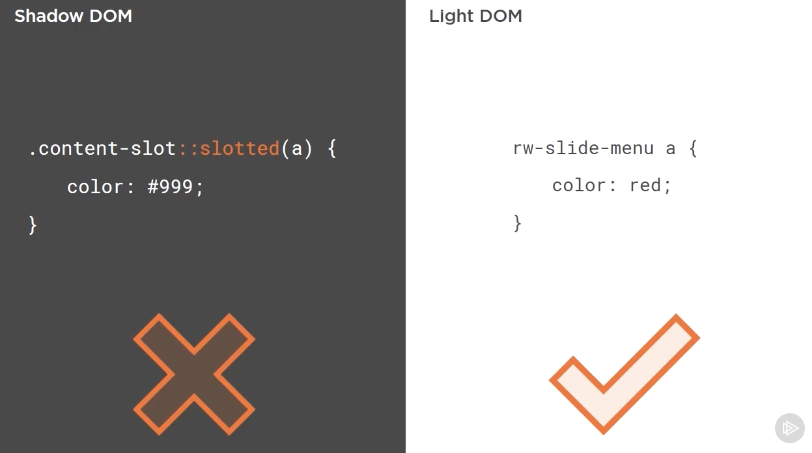
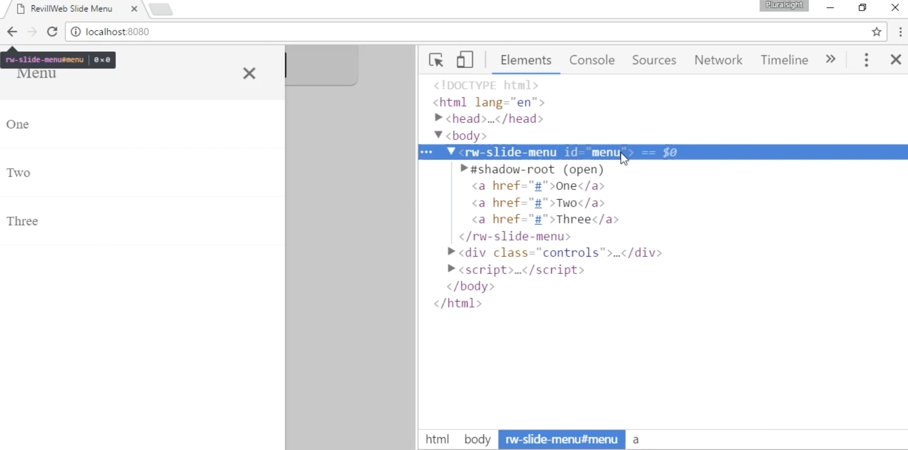

# **Allowing Users to Provide Content with Slotting**

- To finish it, we're going to use another feature of the Shadow DOM. This feauture is called **slotting**.
- Throughout these modules, we will have come to learn that Web Components are all about **encapsulation**, particularly in relation with thw **Shadow DOM**.

- The idea being that Web Component shouldn't affect the outer application and the outer application shouldn't affect the contents of the component.

- But, what about components which require content from the user to be useful: a modal for example is useless unless the user is able to specify the content they want to display inside the modal component.

- The Slide-out menu is exactly the same. We want the users to specify the content inside the menu. This could be any HTML: an image, some text, a few buttons or a list.

- Slotting allows us to do this: As a component user, we can add content as child elements to the Web Component, and then as a component author, using slotting, we can choose where this content is placed whithin the **Shadow Root** of our Web Component.

- The slotting feature projects the content into the **Shadow DOM**, making the elements appear to be within the Shadow Root of the component, but are actually kept within the **Light DOM** of the component. This means that **the usual styling restrictions of the Shadow DOM don't apply to the slotted content**. This is a huge benefit, because component users will be able to style the content they've provided to the component, just like they would style any other DOM elements which was outside of a Shadow Root.

## **In this demo:**

- We'll add slots to the component template for both the menu content and the menu title.
- We'll also add some default style for slotted content
- And finally, we'd specify some fallback text for the title slot, to ensure there's always a title for the menu.

## **More info:**

- we'll open the browser and we can see with the menu open that the 3 anchor tags have been placed in the appropiate place.

- In the element explorer, when we drill down to where the slotted element is, we can see the projection at work.

- The slotted content looks pretty ugly in its current form. The user can style this contentn however they like, because it's still in the **Light DOM**, but as a component authors, we can still add some default styles, so the slotted content look good straight of the box.

- Within the **Shadow DOM** we have a new CSS pseudo selector available to us, which will allow us to add style specifically to slotted content. We can specify tag names. In this example, we're styling all slotted anchor elements whose parent has the class content-slot. In the code we've just written, this is slot element.

- We can use other pseudo selectors, such as he **hover selector** and we also specify classes.

- This all seems great and incredibly useful, but there are limitations:

- You can style top-level items. If you were to do someting like this, it just wouldn't work.

- It's also important to understand that user-specified style will always take precedence over slotted style which is added inside the Shadow DOM. In this example, on the **left** we have added our slotted content style added within the Shadow DOM of our Web Component, and on the **right** we have the user-specified style for the slotted content they added to our component. The user-specified styling would always win. Now we're aware of the slotted pseudo-selector we can use it to add some default style to the slotted anchor elements.

- Back in the browser we open the menu, we can see that it looks so much better. The default styles have been applied to the slotted anchor elements

:)
